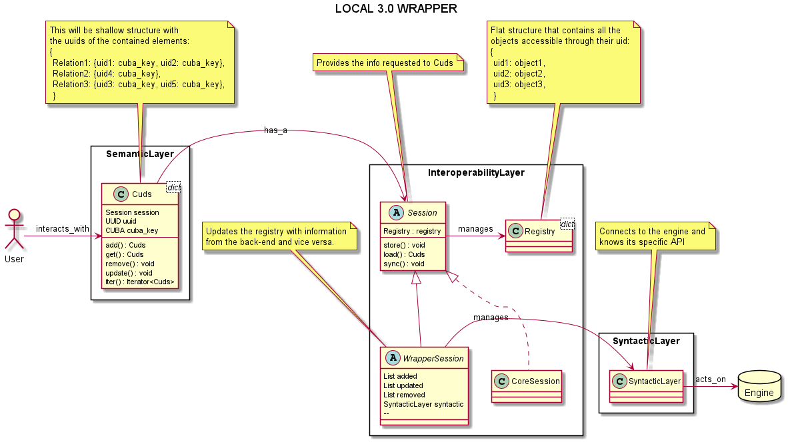
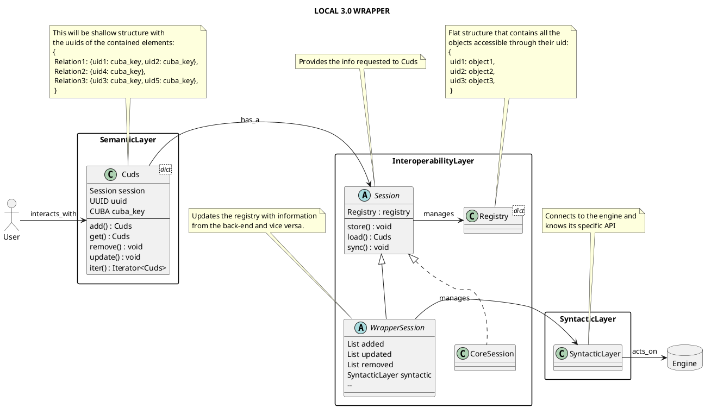
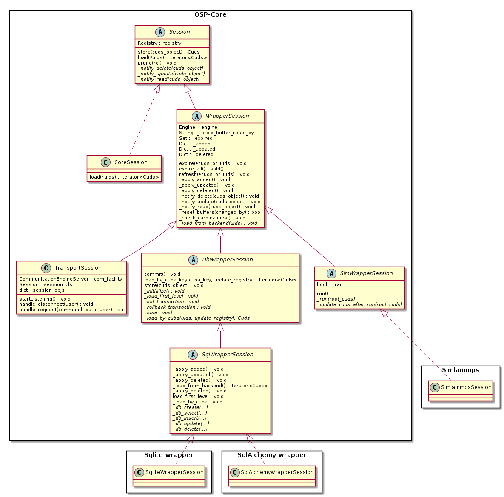
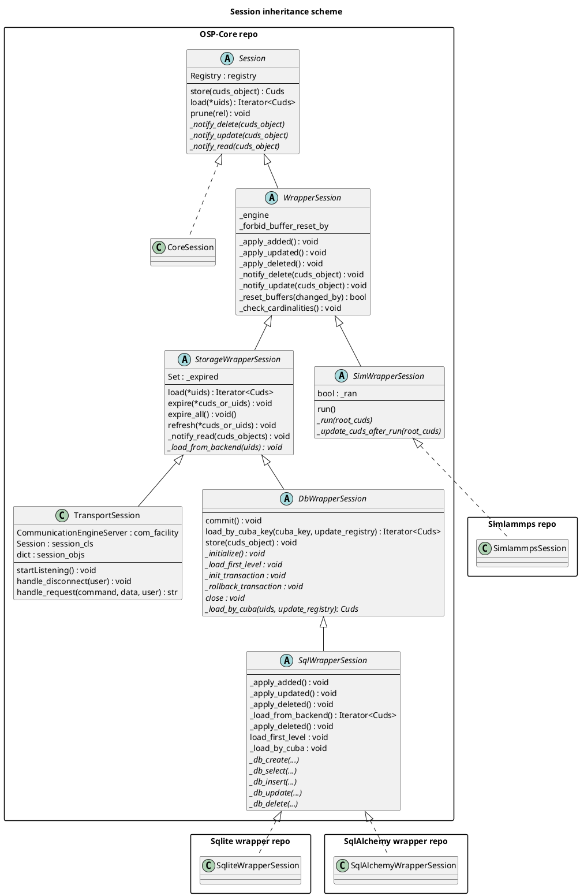

# Wrapper Development
The aim of this project is to explain the structure of a Wrapper for __SimPhoNy v3__ and simplify as much as possible the development of a new one.
For this, the general folder and file structure of a wrapper is simulated here, and notes on what to do (and where) are provided.

## Compatibility

The following table describes the version compatability between the [OSP core](https://gitlab.cc-asp.fraunhofer.de/simphony/osp-core) package and documentation presented in this project.

| __SQLAlchemy wrapper__ | __OSP core__ |
|   :---:   |   :---:  |
|   2.0.0   |   3.1.x-beta  |

The releases of OSP core are available [here](https://gitlab.cc-asp.fraunhofer.de/simphony/osp-core/-/releases).

## Important (utility) functions for wrapper development
- cuds.utils.create_for_session() \
  Create a cuds object directly in a given session.
  Avoids side effects, like creating the cuds object first in the CoreSession and removing other cuds.
  Avoids issues like having the same object twice with same uid.
- cuds.classes.cuds.Cuds.get_attributes() \
  Get the attributes of a cuds object
- cuds.classes.cuds.Cuds.get_datatypes() \
  Get the datatypes of the cuds objects attributes
- cuds.ontology.ontology_datatypes.convert_from() \
  Convert attributes to a serializable format.
- cuds.ontology.ontology_datatypes.convert_to() \
  Convert attributes from a serializable format to the real datatype.

## Structure
The general structure of a local wrapper is:


<details>
  <summary>PlantUML code</summary>



</details>

When support for a new engine is to be added, the wrapper developer has to implement a new Session object and connect it to a syntactic layer that communicates with said engine.

To organise this, an inheritance scheme of Session classes is defined:


<details>
  <summary>PlantUML code</summary>


</details>

As you can see, supporting a new back-end means creating a class that inherits from the proper type of engine, and implementing some pre-defined abstract methods.

This methods will call a syntactic layer instance (`_engine` in the `WrapperSession`) that will communicate to the back-end.

Since the syntactic layer will greatly depend on the specific back-end, no standardisation is provided there.

## Relevant files
 - *.gitignore* 
   - Files to be ignored by git when looking for changes.
 - *.gitlab-ci.yml* 
   - Configuration file for Gitlab's Continuous Integration system.
 - *README.md* 
   - Contains the general description and usage of the wrapper
 - *install_engine.sh*
   - Performs all the necessary installations to connect with Python to the back-end
   - Is triggered by the user when installing (`TODO`: Check this)
 - *install_engine_requirements.sh* 
   - Install the third party requirements of the engine.
   - Might require super user privileges.
   - Called by `install_engine.sh`.
 - *packageinfo.py* 
   - Version and build information.
 - *setup.py* 
   - Installs the wrapper via `setuptools`.
   - Called by the user with `python setup.py install`
 - *examples/* 
   - Examples of usage of the wrapper.
 - *tests/* 
   - Unittesting of the wrapper
 - *some_wrapper/*
   - *some_database|simulation_session.py* 
     - Implements all the necessary methods and functionality of the wrapper.
     - May use other classes or files if necessary
   - *schema.some_wrapper.py* 
     - Defines the minimal requirements that the back-end may have.
     - Will be used to check the input before sending data to the engine to avoid inconsistencies.

## Installation
When the implementation of the wrapper is done, the user should be able to install all the necessary components via:

```shell
user@computer:~/some_wrapper$ ./install_engine.sh
user@computer:~/some_wrapper$ python setup.py install
```
The first command will install the necessary libraries and dependencies so that the wrapper can connect and communicate to the syntactic layer (compile the engine as a shared library, install some python bindings...).

The second call will install the wrapper itself, as well as any python packages it might require (install_requires).

## Contact
[Pablo de Andres](mailto:pablo.de.andres@iwm.fraunhofer.de), 
[Matthias Urban](mailto:matthias.urban@iwm.fraunhofer.de) and 
[Yoav Nahshon](mailto:yoav.nahshon@iwm.fraunhofer.de) from the 
Material Informatics team, Fraunhofer IWM.
