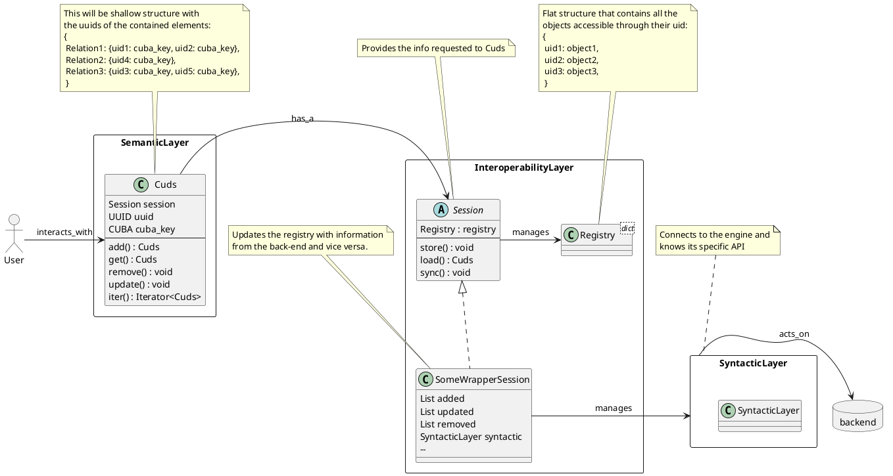
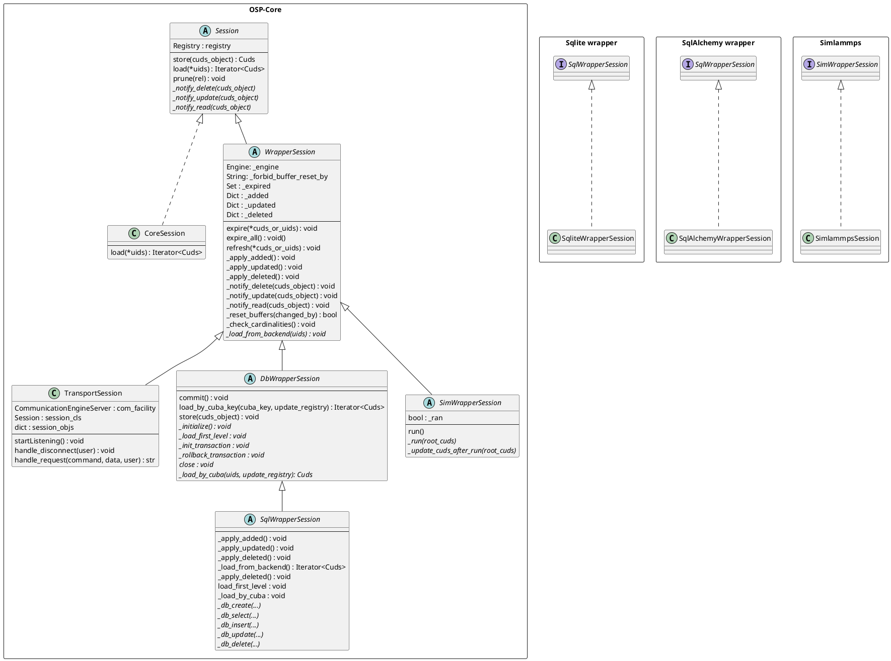

# Wrapper Development
*Version*: 2.1.0

The aim of this project is to explain the structure of a Wrapper for __SimPhoNy v3__ and simplify as much as possible the development of a new one.
For this, the general folder and file structure of a wrapper is simulated here, and notes on what to do (and where) are provided.

We **strongly** recommend going through [getting started](https://gitlab.cc-asp.fraunhofer.de/simphony/getting-started)
before proceeding with this guide.

*Contact*: [Pablo de Andres](mailto:pablo.de.andres@iwm.fraunhofer.de), 
[Matthias Urban](mailto:matthias.urban@iwm.fraunhofer.de) and 
[Yoav Nahshon](mailto:yoav.nahshon@iwm.fraunhofer.de) from the 
Material Informatics team, Fraunhofer IWM.

**Index**
- [Wrapper Development](#wrapper-development)
  - [Compatibility](#compatibility)
  - [Structure](#structure)
  - [Relevant files](#relevant-files)
  - [Important (utility) functions for wrapper development](#important-utility-functions-for-wrapper-development)
  - [Installation](#installation)

## Compatibility

The following table describes the version compatibility between the [OSP core](https://gitlab.cc-asp.fraunhofer.de/simphony/osp-core) package and documentation presented in this project.

| __Wrapper development__ | __OSP core__ |
|:-----------------------:|:------------:|
|          2.2.0          |  3.2.2-beta  |
|          2.1.0          |  3.2.0-beta  |
|          2.0.0          |  3.1.x-beta  |

The releases of OSP core are available [here](https://gitlab.cc-asp.fraunhofer.de/simphony/osp-core/-/releases).

## Structure
Here we want to provide some more background on the internal design of osp-core 
and the wrappers.

If you remember from *getting started*, we presented an architecture that follows 3 layers (i.e. semantic, interoperability and syntactic).

Now we will add some more detail on how the 3 layers interact with each other:



<details>
  <summary>Alternative image</summary>

  

</details>

We have introduced the interoperability layer as the one that synchronises the changes between the backend and the semantic layer.
This makes the interoperability layer, and particularly the session class,
one of most important (if not the most) developments in a wrapper.

When support for a new engine is to be added, the wrapper developer has to implement a new Session object and connect it to a syntactic layer that communicates with said engine.

Since the syntactic layer will greatly depend on the specific backend, no standardisation is provided there.

Regarding the sessions, we already presented a simple hierarchy meant to group functionality.
This schema gains importance in the context of wrapper development, so we will provide a deeper representation:




<details>
  <summary>Alternative image</summary>

  

</details>

As you can see, supporting a new back-end means creating a class that inherits from the proper type of engine, and implementing some pre-defined abstract methods.

This methods will call a syntactic layer instance (`_engine` in the `WrapperSession`) that will communicate to the back-end.

## Relevant files
These are important files when developing a new wrapper.
We present examples and hints on how to write them in this repository:
 - *.gitignore* 
   - Files to be ignored by git when looking for changes.
 - *.gitlab-ci.yml* 
   - Configuration file for Gitlab's Continuous Integration system.
 - *README.md* 
   - Contains the general description and usage of the wrapper
 - *install_engine.sh*
   - Performs all the necessary installations to connect with Python to the back-end
   - Must be triggered by the user when installing
 - *install_engine_requirements.sh* 
   - Install the third party requirements of the engine.
   - Might require super user privileges.
   - Called by `install_engine.sh`.
 - *packageinfo.py* 
   - Version and build information.
 - *setup.py* 
   - Installs the wrapper via `setuptools`.
   - Called by the user with `python setup.py install`
 - *examples/* 
   - Examples of usage of the wrapper.
 - *tests/* 
   - Unittesting of the wrapper
 - *osp/wrappers/some_wrapper/*
   - *some_database|simulation_session.py* 
     - Implements all the necessary methods and functionality of the wrapper.
     - May use other classes or files if necessary
   - *schema.some_wrapper.py* 
     - Defines the minimal requirements that the back-end may have.
     - Will be used to check the input before sending data to the engine to avoid inconsistencies.

## Important (utility) functions for wrapper development
See [osp.core.utils.wrapper_development](https://gitlab.cc-asp.fraunhofer.de/simphony/osp-core/blob/master/osp/core/utils/wrapper_development.py)

## Installation
When the implementation of the wrapper is done, the user should be able to install all the necessary components via:

```shell
(env) user@computer:~/some_wrapper$ ./install_engine.sh
(env) user@computer:~/some_wrapper$ python setup.py install
```
The first command will install the necessary libraries and dependencies so that the wrapper can connect and communicate to the syntactic layer (compile the engine as a shared library, install some python bindings...).

The second call will install the wrapper itself, as well as any python packages it might require (install_requires).