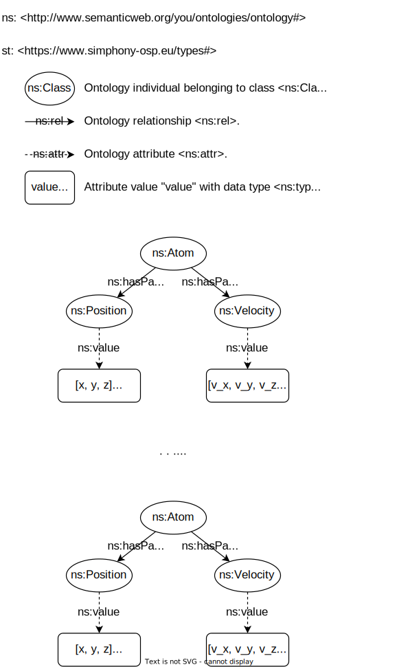

# Usage

Given a collection of atoms, their initial positions, and their velocities,
MyWrapperName uses MySimulationEngine to calculate their future positions, 
under the assumption that atoms do not exert any kind of force among themselves
neither there are any external forces acting on them.

To use MyWrapperName, start by importing it from the `simphony_osp.wrappers` 
module, as well as by importing the `ontology_namespace` namespace.

```python
from simphony_osp.namespaces import ontology_namespace
from simphony_osp.wrappers import SimulationWrapper
```

The next step is to call `SimulationWrapper` to create a SimPhoNy session

```python
session = SimulationWrapper()
session.locked = True  # prevent session from closing after with statement
```

and populate it with your input data.

```python
with session:
    for i in range(3):
        atom = ontology_namespace.Atom()
        atom[ontology_namespace.hasPart] = {
            ontology_namespace.Position(value=[i, i, i], unit="m"),
            ontology_namespace.Velocity(value=[i, -i, i], unit="m/s"),
        }
```        

MyWrapperName uses individuals belonging to classes from MyOntology to 
represent atoms, their positions and velocities. MyWrapperName expects to find
the following pattern in the session's knowledge graph. 

<figure style="display: table; text-align:center; margin-left: auto; margin-right:auto">



<figcaption style="display: table-caption; caption-side: bottom; text-align:center">

_Pattern that MyWrapperName interprets in the session's knowledge graph in 
order to recognize the atoms, their positions and their velocities._

</figcaption>

</figure>

Finally, use SimPhoNy's `compute` command to run the simulation, optionally 
specifying the number of time steps to consider in seconds (defaults to `1`). 
Negative values can be provided in order to run the simulation backwards in 
time.

```python
session.compute()
# session.compute(time_steps=5)
```

After running the simulation, all the same atom, position and velocity ontology
individuals will still be available in the session, but their positions will 
have changed. As there are no forces acting on the atoms, their velocities 
will remain constant.

